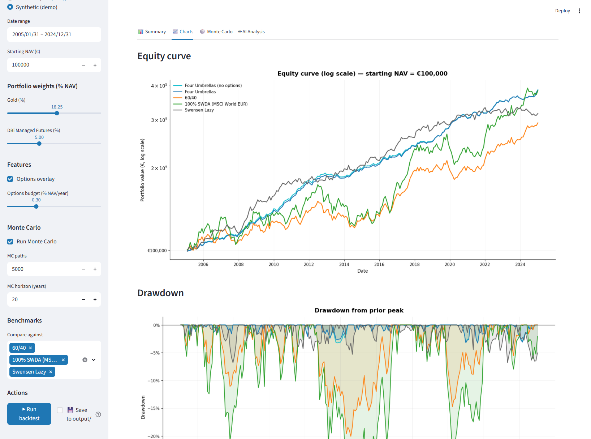
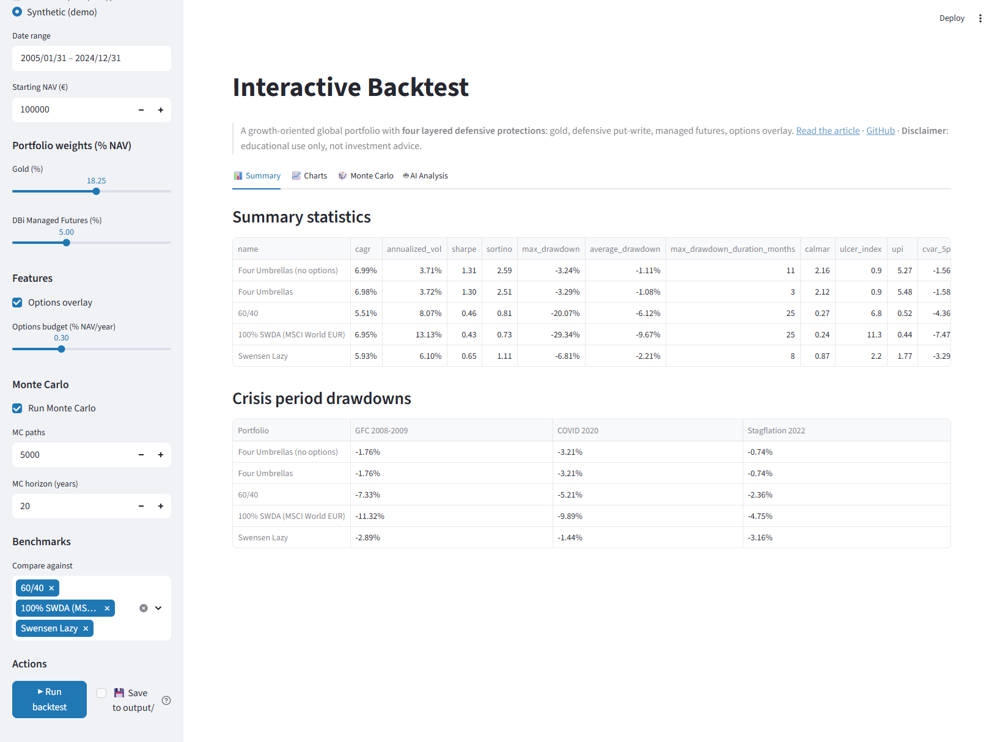

# Portfolio Backtest Engine

[](./LICENSE)
[](https://www.python.org/)
[](#testing)
[](#whats-new)
[](#dashboard-local)
[](#deploy-public)
[](#fire)
[](#ai)
[](https://medium.com/@padosoft)

> **The open-source, fund-manager-grade toolkit for backtesting a multi-asset portfolio over 20 years, stress-testing it with Monte Carlo + rolling windows + Markowitz frontier + Italian tax + FIRE projection, and getting an LLM to review the results — either from the CLI or through a beautiful Streamlit dashboard you can deploy in one click.**

If you are an investor, quant curious, aspiring FIRE retiree, or data scientist who wants to understand what *really* happens to a defensive portfolio across GFC 2008, COVID 2020 and Stagflation 2022 — this repo is your sandbox. **Clone, `pip install`, and you're minutes away from a full report.** You can run it from the terminal, from a one-click dashboard, or deploy it publicly on Streamlit Cloud / HuggingFace Spaces.

The engine currently runs the **Four Umbrellas** defensive preset — the strategy from the companion Medium article [*"The Four Umbrellas Portfolio"*](https://medium.com/@padosoft) — as the default (and only) portfolio; customization for now requires editing `src/portfolio.py`. Every allocation decision, every metric, every chart in that article is reproducible here. **Generic multi-portfolio support (CLI `--portfolio` flag, interactive asset picker, save/load) is tracked in the upcoming PR2+ refactor.**



---

<a id="tldr"></a>
## ⚡ TL;DR — try it in 30 seconds

> **Python newcomers, read this first.** Every `python …` command below assumes you've already activated the project virtual environment in your current terminal. If you haven't, the script will stop with a clear error explaining the two ways to fix it. The full step-by-step install (venv creation + activation + deps) is in [**Installing from scratch**](#install) — do that once, then come back here.

```bash
git clone https://github.com/padosoft/four-umbrellas-backtest.git
cd four-umbrellas-backtest

# 1) Create the virtual environment (once)
python -m venv .venv

# 2) Activate it IN THIS TERMINAL (needed every time you open a new terminal)
#    Windows PowerShell:  .venv\Scripts\Activate.ps1
#    Windows cmd.exe:     .venv\Scripts\activate.bat
#    macOS / Linux:       source .venv/bin/activate

# 3) Install deps (once)
pip install -r requirements.txt

# OPTION A — full CLI report with synthetic data (no data files needed)
python backtest.py --synthetic --monte-carlo
# → open output/REPORT.md — 13 charts, stats tables, MC fan chart

# OPTION B — interactive dashboard (sliders, tabs, AI analysis)
pip install -r requirements-dashboard.txt
streamlit run streamlit_app.py
# → browser opens at http://localhost:8501

# OPTION C — plan your FIRE / retirement
python fire.py --age 45 --sex M --capital 100000 --contributions 1000 \
    --fire-age 60 --spending 2500 --pension --pension-amount 1500 --pension-age 67

# OPTION D — have an LLM critique your portfolio
#    Put your key in a .env file (see the "AI analysis" section), then:
python backtest.py && python analyze.py --results output/
```

> **Don't want to activate the venv?** You can always invoke the venv's Python directly instead of `python` — skip activation entirely and use:
> - Windows: `.venv\Scripts\python.exe backtest.py --synthetic`
> - macOS / Linux: `.venv/bin/python backtest.py --synthetic`
>
> That form works in any shell, any terminal, with zero configuration.

Jump to: [**Install**](#install) · [**CLI reference**](#cli) · [**GUI launch**](#dashboard-local) · [**FIRE**](#fire) · [**AI**](#ai) · [**Deploy to Cloud/HF**](#deploy-public)

---

## Table of contents

- [⚡ TL;DR — try it in 30 seconds](#tldr)
- [🛠️ Installing from scratch (step-by-step)](#install)
- [What's new in v2.0 🚀](#whats-new)
- [🌟 Why you'll actually enjoy using this](#why)
- [📋 CLI reference — everything you can do from the terminal](#cli)
- [🧰 Custom portfolios — `--portfolio` flag](#custom-portfolios)
- [🖥️ Running the interactive dashboard locally](#dashboard-local)
- [📸 Screenshots](#screenshots)
- [🚀 Deploy the dashboard publicly](#deploy-public)
- [🔥 FIRE calculator — plan your retirement](#fire)
- [🤖 AI analysis — LLM-driven qualitative review](#ai)
- [Advanced analyses (sensitivity, rolling window, frontier)](#advanced-analyses)
- [What this is](#what-this-is)
- [Features](#features)
- [What it calculates](#what-it-calculates)
- [Example output](#example-output)
- [Full onboarding](#full-onboarding)
- [Usage recipes](#usage-recipes)
- [Configuration](#configuration)
- [Methodology](#methodology)
- [Architecture](#architecture)
- [FAQ](#faq)
- [Testing](#testing)
- [Roadmap](#roadmap)
- [Contributing](#contributing)
- [Citation](#citation)
- [License & legal](#license--legal)

---

<a id="install"></a>
## 🛠️ Installing from scratch (step-by-step)

Written for readers who "just want to double-click run"— if you already know what a venv is, skip to the [CLI reference](#cli).

### 1. Prerequisites

- **Python 3.11, 3.12, 3.13, or 3.14** — download from [python.org](https://www.python.org/downloads/) if you don't have it. On Windows, tick *"Add python.exe to PATH"* in the installer.
- **Git** — [git-scm.com](https://git-scm.com/downloads)
- A terminal. On Windows, either **PowerShell** (built-in) or **Git Bash** (ships with Git) both work.

Check that Python is installed:

```bash
python --version
# expected: Python 3.11.x  (or 3.12 / 3.13 / 3.14)
```

### 2. Clone the project and enter the folder

```bash
git clone https://github.com/padosoft/four-umbrellas-backtest.git
cd four-umbrellas-backtest
```

Everything below assumes your terminal is inside this `four-umbrellas-backtest/` folder.

### 3. Create the virtual environment (once, ~10 seconds)

A virtual environment is a private, project-local copy of Python that keeps this project's dependencies isolated from the rest of your system.

```bash
python -m venv .venv
```

You now have a `.venv/` folder in the project. Do not edit it; Git ignores it.

### 4. Activate the venv IN YOUR CURRENT TERMINAL

**This is the step most people miss.** You must activate the venv every time you open a new terminal window. If you skip it, the scripts will stop with a clear error and point you back here.

| Terminal | Activation command |
|---|---|
| **Windows PowerShell** | `.venv\Scripts\Activate.ps1` |
| **Windows cmd.exe** | `.venv\Scripts\activate.bat` |
| **Windows Git Bash / WSL** | `source .venv/Scripts/activate` |
| **macOS / Linux** | `source .venv/bin/activate` |

You'll know activation worked when your prompt gets a `(.venv)` prefix:

```text
(.venv) PS C:\Users\you\four-umbrellas-backtest>
```

> **PowerShell says "running scripts is disabled"?** Run this once, answer `Y`, then retry activation:
>
> ```powershell
> Set-ExecutionPolicy -Scope CurrentUser -ExecutionPolicy RemoteSigned
> ```

> **Prefer zero activation?** Replace every `python …` command in this README with `.venv\Scripts\python.exe …` (Windows) or `.venv/bin/python …` (macOS/Linux). It's the same thing — the venv's Python knows to use its own packages.

### 5. Install the dependencies (once, ~1 minute)

```bash
pip install -r requirements.txt
```

For the Streamlit dashboard, also install:

```bash
pip install -r requirements-dashboard.txt
```

For running tests locally:

```bash
pip install -r requirements-dev.txt
```

### 6. First run — verify the pipeline works

```bash
python backtest.py --synthetic
```

You should see progress logs and `output/REPORT.md` appear at the end. If this works, you're done installing.

### 7. (Optional) Set up an `.env` for AI analysis

If you want [AI analysis](#ai), create a `.env` file at the project root:

```bash
# Windows (PowerShell)
Copy-Item .env.example .env

# macOS / Linux
cp .env.example .env
```

Then open `.env` in any text editor and paste your API key(s). See the [AI section](#ai) for the full guide.

### 8. Every session after that

Each new terminal window:

```bash
cd four-umbrellas-backtest
.venv\Scripts\Activate.ps1    # (or the right activation command for your shell)
python backtest.py --synthetic --monte-carlo   # or any other command
```

That's the entire loop. If something ever fails with `ModuleNotFoundError: No module named 'pandas'`, it means step 4 (activation) was skipped in that terminal — just run it again.

---

<a id="cli"></a>
## 📋 CLI reference — everything you can do from the terminal

The toolkit exposes three top-level commands, each fully `--help`-able. This table lists the most useful flags; run `python <command>.py --help` for the complete list.

### `backtest.py` — the main engine

| Flag | What it does | Example |
|---|---|---|
| *(none)* | Full 20-year run, options overlay on, no MC | `python backtest.py` |
| `--start YYYY-MM-DD` / `--end YYYY-MM-DD` | Constrain the period | `--start 2008-01-01 --end 2023-12-31` |
| `--nav AMOUNT` | Starting NAV in EUR (default 100 000) | `--nav 250000` |
| `--synthetic` | Use random-walk data (no real files needed) | `python backtest.py --synthetic` |
| `--no-options` | Disable the semi-annual put-spread overlay | `python backtest.py --no-options` |
| `--monte-carlo` | Run block-bootstrap Monte Carlo — auto-includes **Prudente / Mediana / Ottimista (10°/50°/90°)** scenarios table + chart (NEW v2) | `python backtest.py --monte-carlo --mc-paths 10000 --mc-years 20` |
| `--mc-paths N` · `--mc-years Y` · `--mc-block-size M` | Tune MC (defaults: 5000 paths, auto horizon, 3-month blocks) | `--mc-paths 20000 --mc-years 30 --mc-block-size 3` |
| `--sensitivity PARAM --range LO HI --step S` | Sweep a parameter | `--sensitivity gold --range 0.10 0.25 --step 0.025` |
| `--sensitivity PARAM --values V1 V2 ...` | Sweep specific values | `--sensitivity rebalance_freq --values 1 2 4 12` |
| `--rolling-window --window-years N --step-months M` | Rolling-window stress test | `--rolling-window --window-years 10 --step-months 1` |
| `--efficient-frontier --n-random N` | Markowitz + Dirichlet sampling | `--efficient-frontier --n-random 50000` |
| `--output-dir DIR` | Where to write outputs (default `output/`) | `--output-dir output/custom-run` |

> **Tax modeling** is available programmatically via `src/tax.py` (`TaxLedger`, `TaxConfig` — 26% CGT with 4-year *minusvalenze* FIFO carry, 12.5% gov-bond rate). Wiring it behind a `--tax` CLI flag is on the [roadmap](#roadmap); for now, `import` it from your own script or test to apply tax drag on realized rebalance flows.

### `fire.py` — FIRE / retirement planner (NEW v2)

```bash
python fire.py --age 45 --sex M --capital 100000 --contributions 1000 \
    --fire-age 60 --spending 2500 --inflation 0.02 \
    --pension --pension-amount 1500 --pension-age 67 --pension-revaluation 0.75 \
    --tax-on-withdrawals --simulations 5000
```

See the [full FIRE section](#-fire-calculator-plan-your-retirement) for every parameter.

### `analyze.py` — standalone AI analysis runner (NEW v2)

```bash
# Analyze a REPORT.md you already produced
python analyze.py --results output/
python analyze.py --results output/ --provider anthropic --model claude-opus-4-7
python analyze.py --results output/ --provider local --model kimi-k2
python analyze.py --results output/ --extra output/sensitivity/gold.csv
```

See the [AI analysis section](#-ai-analysis-llm-driven-qualitative-review) for provider setup.

### `streamlit_app.py` — the GUI (NEW v2)

```bash
pip install -r requirements-dashboard.txt
streamlit run streamlit_app.py
# → opens http://localhost:8501
```

See [Running the interactive dashboard locally](#running-the-interactive-dashboard-locally) for the tour.

---

<a id="custom-portfolios"></a>
## 🧰 Custom portfolios — `--portfolio` flag (PR2)

Starting with PR2 the engine accepts **any portfolio composition** from the CLI, not just the hardcoded Four Umbrellas preset. The default is unchanged — `python backtest.py --synthetic` still runs the Four Umbrellas preset and produces byte-identical output.

### How to pick a portfolio

```bash
# 1) No flag → default preset (Four Umbrellas). Zero diff from pre-PR2.
python backtest.py --synthetic

# 2) By NAME — resolves to portfolios/<name>.toml. Ship your own TOML
#    in portfolios/my_strategy.toml and load it by name:
python backtest.py --synthetic --portfolio my_strategy

# 3) By PATH — any path ending in .toml or containing a /:
python backtest.py --synthetic --portfolio portfolios/four_umbrellas.toml
python backtest.py --synthetic --portfolio /absolute/path/to/some.toml

# 4) Inline JSON — anything starting with '{':
python backtest.py --synthetic --portfolio \
  '{"name":"Toy","assets":[{"key":"gold","weight":0.5},{"key":"cash","weight":0.5}]}'

# List every preset in portfolios/ and exit
python backtest.py --list-portfolios
```

### Preset file format (TOML)

A preset is a plain TOML file. Weights MUST sum to 1.0 ±0.002 — the loader rejects anything else with a clear error. The available asset keys come from [`data/catalog.toml`](./data/catalog.toml); add your own catalog entries to register new datasets.

```toml
# portfolios/my_strategy.toml
name = "My defensive strategy"
notes = "40/40/20 gold/equity/cash — example"
options_overlay = false             # SPY/QQQ put-spread overlay (needs SPY+QQQ+VIX data)
rebalance_months = [1, 7]           # January + July (semi-annual)
transaction_cost_bps = 20.0

[[assets]]
key    = "gold"
weight = 0.4

[[assets]]
key    = "quality"
weight = 0.4

[[assets]]
key    = "cash"
weight = 0.2
```

### Combine `--portfolio` with the advanced analyses

Since PR3 every advanced analysis accepts the `--portfolio` spec and
operates on that portfolio — no more "uses the default preset" warning:

```bash
# Efficient frontier restricted to your portfolio's asset universe
python backtest.py --synthetic --portfolio my_strategy --efficient-frontier

# Rolling 10-year windows simulated against your portfolio
python backtest.py --synthetic --portfolio my_strategy --rolling-window --window-years 10

# Sensitivity sweep on a weight inside your portfolio (not the globals)
python backtest.py --synthetic --portfolio my_strategy --sensitivity gold --range 0.10 0.25 --step 0.05
```

Two caveats on the sensitivity path when a custom portfolio is in use:

- **`--sensitivity options_budget` on a custom portfolio** is not yet
  supported — the options overlay still reads the global `OPTIONS` config;
  a per-portfolio `OptionsConfig` lands in PR5. Workaround: sweep
  `options_budget` on the default preset (no `--portfolio`).
- **Weight-like params** (`gold`, `dbi`, `put_write`, `nasdaq_top30`,
  `momentum`, `quality`) require the portfolio to contain both a matching
  asset and an explicit `cash` sleeve (the delta is absorbed by cash).
  The error message points at the specific missing piece.

---

<a id="whats-new"></a>
## What's new in v2.0 🚀

A massive feature rollout delivered in **11 reviewed-and-merged PRs** on top of the 1.0 baseline, **267 tests passing** across the matrix:

| # | Feature | What it unlocks |
|---|---|---|
| 1 | 📊 **Metrics++** | Average Drawdown, Max DD duration (months), **UPI** (Ulcer Performance Index, Martin 1989) — drawdown-aware risk assessment |
| 2 | 🎲 **MC scenarios** | Explicit **Prudente (10°) / Mediana (50°) / Ottimista (90°)** percentiles with € values and implied CAGR — what clients actually need to see |
| 3 | 🏛️ **Classic benchmarks** | Golden Butterfly (Tyler), Harry Browne Permanent, Dalio All-Weather (official), Swensen Lazy — compare against the giants |
| 4 | 🎚️ **Sensitivity sweep** | One CLI flag iterates any parameter (`gold`, `dbi`, `options_budget`, `rebalance_freq`, `put_write`, `nasdaq_top30`, `momentum`, `quality`) across a range — instant "what if" analysis |
| 5 | 🌀 **Rolling-window backtest** | N-year window slid monthly/quarterly/annually — answers *"would this portfolio have worked regardless of when I started investing?"* |
| 6 | 📐 **Efficient Frontier** | Markowitz MVO + **50k Dirichlet-sampled random portfolios**, Max Sharpe / Min Vol / Max Return markers, Four Umbrellas reference dot. **Interactive Plotly chart** — hover any point to see its allocation breakdown |
| 7 | 🇮🇹 **Italian tax modeling** | 26% CGT, 4-year *minusvalenze* carry-forward with FIFO compensation, 12.5% gov-bond rate, pension exempt during accumulation — proper after-tax numbers |
| 8 | 🔥 **FIRE calculator** | 2-phase Monte Carlo (accumulation → decumulation) with **ISTAT 2023 mortality sampling**, INPS-style pension revaluation, CGT on withdrawals, 4 dedicated charts |
| 9 | 🤖 **AI analysis** | Pluggable LLM provider: **OpenRouter** (default) / OpenAI / Anthropic / Local (Ollama, vLLM, LM Studio) — structured Italian review |
| 10 | 🖥️ **Streamlit dashboard** | Full interactive UI: sidebar form, Run/Save buttons, tabs for Summary / Charts / MC / AI. Deploy configs for local, **Streamlit Cloud**, and **HuggingFace Spaces** (Dockerfile) |
| 11 | ⚙️ **CI/CD + docs** | GitHub Actions matrix (3 OS × 2 Python) runs pytest + 6 smoke tests + artifact upload on every PR |

**All v2 features are additive and flag-gated — default behavior preserves v1 compatibility.** Existing users can `git pull` with zero surprises.

---

<a id="why"></a>
## 🌟 Why you'll actually enjoy using this

Most "portfolio backtesters" on the web are either (a) black-box web tools where you cannot see the methodology, (b) deep quant libraries (backtrader, vectorbt) with a steep learning curve for a single-portfolio study, or (c) academic code dumps that require significant rewiring to fit a custom allocation.

**This project is deliberately in the middle — and tries very hard to be joyful to use:**

- 🎯 **One command, full report** — `python backtest.py` → `output/REPORT.md` with 13 charts and all stats. No plumbing.
- 🖱️ **Dashboard for the GUI people** — `streamlit run streamlit_app.py` and you're clicking sliders.
- 📚 **Readable source** — every business-logic module is < 300 lines. Audit it. Fork it. Teach with it.
- 🔬 **Academically grounded** — citations for every methodological choice (Israelov & Nielsen on options, Politis & White on block bootstrap, Martin on UPI).
- 🧪 **267 tests**, CI on Ubuntu / macOS / Windows × Python 3.11 / 3.12. PRs blocked if tests fail.
- 🇮🇹 **Localized for Italy** — tax rules, ISTAT mortality tables, INPS pension revaluation, Italian LLM output. Also works for anyone else; flag-gate what you don't need.
- 🆓 **MIT license** on the code. No strings.

If you are building your own portfolio, writing about markets, studying for a CFA, teaching a finance class, or just curious whether all these scenarios actually matter — **clone it, run it, fork it, publish your numbers**. PRs welcome.

---

## What this is

A self-contained Python backtest engine that:

1. **Simulates a multi-asset portfolio** with configurable weights across 19 sleeves (equity factors, gold, managed futures, bonds, crypto, EM satellites, options overlay).
2. **Benchmarks it** against five reference portfolios out of the box: 100% S&P 500 TR (EUR), 100% SWDA (MSCI World EUR), 60/40, All-Weather proxy, and the portfolio without the options overlay.
3. **Computes 14 performance metrics** per portfolio — CAGR, annualized vol, Sharpe, Sortino, Max Drawdown, Calmar, Ulcer Index, CVaR 5%, longest underwater period (months), recovery months, best/worst month, % positive months, total return.
4. **Generates 13 charts** covering equity curves, drawdowns, underwater periods, rolling statistics, crisis zooms, annual returns, risk-return positioning, metric comparisons, sleeve correlations, Monte Carlo simulations.
5. **Produces a unified Markdown report** (`output/REPORT.md`) that bundles every chart and table into one consumable document — no data viewer required beyond a Markdown renderer.
6. **Runs a block-bootstrap Monte Carlo** simulation (configurable paths and horizon) with a fan chart and terminal-wealth distribution.
7. **Is fully reproducible**: configurable date range, deterministic random seed for the MC simulation, every parameter exposed in one file.

---

## Why it exists

Most "portfolio backtesters" on the web are either (a) black-box web tools where you cannot see the methodology, (b) deep quant libraries (backtrader, vectorbt) with a steep learning curve for a single-portfolio study, or (c) academic code dumps that require significant rewiring to fit a custom allocation.

This project sits deliberately in the middle:

- **Opinionated** — it implements one portfolio family very well, instead of being a generic framework.
- **Auditable** — every line of business logic (rebalancing, options pricing, metric computation) is readable in < 300 lines per module.
- **Defensible** — citations for every methodological choice, alignment with published practitioner literature (AQR, CBOE, SG).
- **Redistributable** (the code; not the data — see [License & legal](#license--legal)).

If you are building your own portfolio and want a starting point that is academically grounded but not dogmatic, this is a good scaffold to fork.

---

## Features

### Portfolio modeling
- ✅ 19-sleeve allocation with independent weights (configurable in `src/portfolio.py`)
- ✅ EUR / USD hedging per sleeve (each sleeve flagged hedged or unhedged)
- ✅ TER (annual expense ratio) deduction per sleeve
- ✅ Semi-annual rebalancing with configurable months (default Jan/Jul)
- ✅ Rebalance-by-buying philosophy (flow-driven, not sell-driven) — the alternative to traditional rebalancing is in the article
- ✅ BTC activation date awareness (BTC sleeve is 0% pre-2014, target weight post-2014)
- ✅ Transaction cost modeling (20 bps round-trip, configurable)

### Defensive overlays
- ✅ **Options overlay** — SPY + QQQ debit put spreads, semi-annual rolls, Black-Scholes + VIX (skew-adjusted) pricing per *Israelov & Nielsen (2015)*
- ✅ **2×/3× take-profit rule** — mechanical daily check, closes 50% at 2× premium, 100% at 3× (solves the whipsaw problem — see article §15)
- ✅ **Fixed budget discipline** — options overlay hard-capped at 0.30% NAV/year

### Benchmarks (out of the box)
- ✅ **100% S&P 500 TR EUR** — US large-cap equity reference
- ✅ **100% SWDA / MSCI World EUR** — global equity reference (iShares Core MSCI World proxy)
- ✅ **60/40** — 60% MSCI World + 40% Bloomberg Euro Aggregate
- ✅ **All-Weather proxy** — 30/40/15/7.5/7.5 equity/long-bonds/short-bonds/gold/commodities
- ✅ **Four Umbrellas (no options)** — for isolating the contribution of the options overlay

### Analytics
- ✅ 14 performance metrics (see [What it calculates](#what-it-calculates))
- ✅ 13 publication-quality charts (see [Example output](#example-output))
- ✅ Rolling 3-year Sharpe and return series
- ✅ Crisis-period peak-to-trough drawdowns (GFC 2008, COVID 2020, Stagflation 2022)
- ✅ Block-bootstrap Monte Carlo with percentile fan chart and terminal-wealth distribution

### Operational
- ✅ **Configurable date range** — `--start` and `--end` CLI flags
- ✅ **Configurable NAV** — `--nav` CLI flag (default €100,000 — but the math is scale-invariant)
- ✅ **Synthetic data mode** — `--synthetic` flag to test the pipeline without real data
- ✅ **Unified Markdown report** — `output/REPORT.md` ties all outputs together
- ✅ **Google Colab notebook** — one-click browser-based execution
- ✅ Deterministic seeds for reproducibility
- ✅ MIT license — no strings on the code

---

## What it calculates

### Performance metrics (per portfolio)

| Metric | Formula / interpretation |
|---|---|
| **CAGR** | Compound Annual Growth Rate: `(W_end / W_start)^(1/years) - 1` |
| **Annualized Volatility** | `σ(monthly returns) × √12` |
| **Sharpe Ratio** | `(CAGR - RF) / annualized_vol` with annualized excess returns |
| **Sortino Ratio** | `(CAGR - RF) / downside_deviation` — penalizes only negative returns |
| **Max Drawdown** | Largest peak-to-trough loss over the period |
| **Calmar Ratio** | `CAGR / |Max DD|` — return per unit of worst loss |
| **Ulcer Index** | RMS drawdown depth — integrates depth × duration |
| **CVaR 5%** (Expected Shortfall) | Average return in the worst 5% of months |
| **Worst Month / Best Month** | Min / max of the monthly return series |
| **% Positive Months** | Fraction of months with positive returns |
| **Total Return** | End-to-end cumulative return over the period |
| **Longest Underwater Period** | Longest consecutive stretch (in months) below the prior all-time high |
| **Recovery Months** | Months from worst drawdown bottom to a new all-time high |
| **Average Drawdown** (v2.0) | Mean of underwater values — less noisy than Max DD |
| **Max DD Duration** (v2.0) | Duration in months of the single worst peak-to-trough event |
| **UPI** (v2.0) | Ulcer Performance Index: `(CAGR - RF) / Ulcer Index` — drawdown-aware Sharpe (Martin 1989) |

### Crisis-period analysis

Peak-to-trough drawdown within each of:
- **GFC (Jan 2008 – Jun 2009)**
- **COVID (2020)**
- **Stagflation (2022)**

...for every portfolio modeled.

### Monte Carlo statistics (when `--monte-carlo` is enabled)

- Terminal wealth percentiles: 5th, 25th, 50th (median), 75th, 95th
- Probability of positive nominal return over horizon
- Probability of Max Drawdown exceeding 20%
- Probability of Max Drawdown exceeding 40%
- Median Max Drawdown across all simulated paths
- Worst-5% Max Drawdown (95th percentile of drawdown magnitude)

### Correlation analysis

- Pearson correlation matrix between all sleeves of the main portfolio (monthly returns). Shows diversification quality and concentration risks within the allocation.

---

## Example output

> **Note.** Real outputs are generated only after you source the data and run the backtest. Below are the 13 chart types the engine produces, rendered in the order they appear in `output/REPORT.md`.

| # | Chart | What you learn |
|---|---|---|
| 1 | `equity_curve.png` | Log-scale wealth paths of every portfolio side-by-side over 20 years |
| 2 | `drawdown.png` | How deep each portfolio went into drawdown, running through time |
| 3 | `underwater.png` | How long each portfolio stayed under the prior all-time high (one subplot per portfolio) |
| 4 | `rolling_sharpe.png` | Rolling 3-year Sharpe ratio — shows where the risk-adjusted return came from |
| 5 | `rolling_returns.png` | Rolling 3-year cumulative return — helps spot regimes of outperformance |
| 6 | `crisis_zoom.png` | Side-by-side comparison during GFC, COVID, and Stagflation 2022 |
| 7 | `annual_returns.png` | Grouped bar chart: each year, one bar per portfolio |
| 8 | `return_distribution.png` | Overlapped histograms of monthly returns — shows tail behavior |
| 9 | `risk_return_scatter.png` | CAGR vs Vol, marker size = |Max DD| — efficient-frontier-like positioning |
| 10 | `metrics_comparison.png` | Grouped bar chart of CAGR, Vol, |Max DD|, Sharpe, Sortino, Calmar |
| 11 | `correlation_heatmap.png` | Correlation matrix between all sleeves — diversification check |
| 12 | `monte_carlo_fan.png` | Percentile fan chart from N bootstrap paths over a future horizon |
| 13 | `monte_carlo_distribution.png` | Terminal-wealth histogram from the MC simulation |

Plus `REPORT.md` bundling all of them in one Markdown document, and two CSV exports (`summary_statistics.csv`, `monthly_returns.csv`) for spreadsheet analysis.

---

## Quick start (5 minutes)

Works end-to-end with **synthetic data** so you can verify the plumbing before sourcing the real data.

```bash
# 1. Clone and install
git clone https://github.com/padosoft/four-umbrellas-backtest.git
cd four-umbrellas-backtest

# 2. Create virtual environment
python -m venv .venv
# macOS / Linux:
source .venv/bin/activate
# Windows (PowerShell):
.venv\Scripts\Activate.ps1

# 3. Install dependencies
pip install -r requirements.txt

# 4. Run on synthetic data (2-year, random-walk pricing, for plumbing check ONLY)
python backtest.py --synthetic --start 2023-01-31 --end 2024-12-31

# 5. Inspect outputs
ls output/
# -> REPORT.md + 13 PNG charts + 2 CSVs
# Open output/REPORT.md in any Markdown viewer (VS Code works great).
```

If `REPORT.md` opens and shows all 13 charts inline, the pipeline works. Now you're ready for real data.

---

<a id="dashboard-local"></a>
## Running the interactive dashboard locally

The Streamlit dashboard gives you a **full interactive UI** with sliders, checkboxes, portfolio selection, tabbed charts, AI analysis button, and a "Save to output/" checkbox. No CLI needed.

### Install and launch (2 commands)

```bash
pip install -r requirements-dashboard.txt
streamlit run streamlit_app.py
```

Opens automatically at [http://localhost:8501](http://localhost:8501) in your default browser.

### What you can do in the dashboard

- **Sidebar — configure the run:**
  - Data source (real data from `data/raw/` or synthetic demo)
  - Date range (slide start/end)
  - Starting NAV
  - Portfolio weight sliders (gold %, DBi %) — cash auto-rebalances to keep WEIGHTS sum = 1.0
  - Options overlay toggle + budget slider
  - Monte Carlo config (paths + horizon + block size)
  - Benchmark multi-select
  - **▶ Run backtest** button — executes the full pipeline
  - **💾 Save to output/** checkbox — when ticked, results are persisted to `output/dashboard_run/`; otherwise session-only (ephemeral)
- **Main area — tabbed results:**
  - 📊 **Summary** — stats table + crisis drawdown table + configuration echo
  - 📈 **Charts** — 10+ inline charts (equity curve, drawdown, underwater, rolling Sharpe, crisis zoom, annual returns, return distribution, risk-return scatter, metrics comparison, correlation heatmap)
  - 🎲 **Monte Carlo** — Prudente/Mediana/Ottimista metric cards + fan chart
  - 🤖 **AI Analysis** — pick a provider (OpenRouter / OpenAI / Anthropic / Local), hit "Run AI analysis", get structured Italian feedback inline

---

<a id="screenshots"></a>
## 📸 Screenshots

A quick preview of what the Streamlit dashboard looks like when you run it locally.

### Summary tab — statistics & crisis drawdowns

Sidebar on the left (data source, date range, NAV, portfolio weight sliders, features, Monte Carlo, benchmarks, Run/Save actions). Main area shows the summary-statistics table (CAGR, vol, Sharpe, Sortino, Max DD, Calmar, Ulcer, CVaR, UPI, …) and the crisis peak-to-trough drawdowns (GFC 2008, COVID 2020, Stagflation 2022) for every portfolio side-by-side.



### Charts tab — equity curve & drawdown

The Charts tab shows the full set of inline charts (equity curve on a log scale, drawdown from prior peak, underwater periods, rolling Sharpe, crisis zooms, annual returns, return distribution, risk/return scatter, metrics comparison, correlation heatmap). Screenshot below shows the first two stacked.


---

<a id="deploy-public"></a>
## 🚀 Deploy the dashboard publicly

Three deploy targets ship pre-configured. Pick your favorite.

### Option 1 — Streamlit Cloud (one click, free for public repos)

1. Push this repo to GitHub (public or private with access granted)
2. Go to [share.streamlit.io](https://share.streamlit.io)
3. New app → select your repo → main file: `streamlit_app.py`
4. Add secrets (optional, for AI analysis): `OPENROUTER_API_KEY = "..."`
5. Deploy. You get a public URL in ~2 minutes.

The bundled `.streamlit/config.toml` + `requirements-dashboard.txt` are picked up automatically.

### Option 2 — HuggingFace Spaces (Docker-based, free tier)

1. Create a new Space with SDK: **Docker**
2. Clone this repo into the Space (or push a fork)
3. The bundled `Dockerfile` builds the dashboard on HF's runner (port 7860)
4. Push — the Space builds and serves at your HF URL automatically

### Option 3 — your own server (Docker)

```bash
docker build -t four-umbrellas-dashboard .
docker run -p 7860:7860 four-umbrellas-dashboard
# → open http://localhost:7860
```

The `Dockerfile` is tuned for HuggingFace Spaces (port 7860) but works anywhere Docker runs.

---

<a id="fire"></a>
## 🔥 FIRE calculator — plan your retirement

Standalone FIRE (Financial Independence, Retire Early) Monte Carlo simulator with **Italian mortality tables** (ISTAT 2023) and INPS-style pension revaluation.

### Basic usage

```bash
python fire.py --age 45 --sex M --capital 100000 --contributions 1000 \
  --fire-age 60 --spending 2500 --inflation 0.02 --simulations 1000
```

### With pension + tax

```bash
python fire.py --age 45 --sex M --capital 100000 --contributions 1000 \
  --fire-age 60 --spending 2500 --inflation 0.02 \
  --pension --pension-amount 1500 --pension-age 67 --pension-revaluation 0.75 \
  --tax-on-withdrawals --simulations 5000
```

### Configurable parameters

| Group | Parameters |
|---|---|
| **Personal** | `--age`, `--sex`, `--fixed-end-age` (skip mortality sampling) |
| **Wealth** | `--capital`, `--contributions`, `--frequency` (`month` or `year`) |
| **Goal** | `--fire-age`, `--spending`, `--inflation` |
| **Pension** | `--pension`, `--pension-amount`, `--pension-age`, `--pension-revaluation` (1.0 = 100% INPS perequazione, 0.75 = 75%, 0 = no adjustment) |
| **Tax** | `--tax-on-withdrawals`, `--tax-rate` |
| **Simulation** | `--simulations`, `--block-size`, `--seed` |

### What it produces

Four dedicated charts + statistics panel:

1. **Portfolio projection** — percentile bands (5/25/50/75/95) from age to death, with FIRE age + pension start markers
2. **Success probability** — % of simulations where portfolio > 0 at each age
3. **Failure age distribution** — histogram (or confirmation message if all successes)
4. **Legacy distribution** — nominal + real final wealth histograms
5. **Console summary** — success probability, median legacy (nominal + real), worst-case failure age

---

<a id="ai"></a>
## 🤖 AI analysis — LLM-driven qualitative review

Send backtest results to an LLM for qualitative analysis (punti di forza, debolezze, raccomandazioni con numeri specifici, caveat metodologici, verdetto finale).

### Provider support

| Provider | Env var for the key | Default model (change with `--model`) |
|---|---|---|
| **OpenRouter** (default — one key, many models) | `OPENROUTER_API_KEY` | `anthropic/claude-opus-4-7` |
| OpenAI | `OPENAI_API_KEY` | `gpt-4o` |
| Anthropic | `ANTHROPIC_API_KEY` | `claude-opus-4-7` |
| Local (Ollama / vLLM / LM Studio) | — (usually no key) | `kimi-k2-0.6b` |

For a **local** provider, optionally set `LOCAL_API_BASE_URL` (default `http://localhost:11434/v1` for Ollama).

<a id="ai-env-setup"></a>
### 🔑 Configure your API key with a `.env` file (recommended)

The project reads API keys from a plain-text `.env` file at the project root. This is the easiest path for everyone who isn't already comfortable with `export` / `setx`.

#### 1. Where does the file go?

At the **project root** — the same folder that contains `backtest.py`, `fire.py`, `analyze.py`, and `requirements.txt`:

```text
four-umbrellas-backtest/
├── backtest.py
├── fire.py
├── analyze.py
├── .env              ← HERE (you create it)
├── .env.example      ← template shipped with the repo
├── requirements.txt
├── src/
└── …
```

The file is named **exactly `.env`** — with the leading dot, no extension. On Windows Explorer, enable "File name extensions" to avoid accidentally creating `.env.txt`.

`.env` is already listed in `.gitignore`, so your keys will never be committed.

#### 2. Create it from the template

```bash
# Windows (PowerShell)
Copy-Item .env.example .env

# Windows (cmd.exe)
copy .env.example .env

# macOS / Linux
cp .env.example .env
```

#### 3. Edit `.env` and paste your key(s)

Open `.env` in any text editor (Notepad, VS Code, nano, …) and replace the placeholder with your real key. Set ONLY the provider(s) you actually use — leave the others as placeholders or delete their lines.

```dotenv
# Example — OpenRouter (recommended, single key for many models)
OPENROUTER_API_KEY=sk-or-v1-abc123yourrealkeyhere

# If you'd rather use OpenAI directly:
# OPENAI_API_KEY=sk-proj-xxxxxx

# If you'd rather use Anthropic directly:
# ANTHROPIC_API_KEY=sk-ant-xxxxxx

# Local (Ollama), no key needed. Only uncomment if your endpoint isn't the default:
# LOCAL_API_BASE_URL=http://localhost:11434/v1
```

Format rules:
- `KEY=value`, one per line.
- No spaces around `=`.
- Quotes (`"…"`) are allowed but not required.
- Lines starting with `#` are comments. Blank lines are ignored.
- Real shell environment variables (if you already `export`ed them) **always win** over `.env`, so you can override per-session.

#### 4. Where do I get the keys?

| Provider | Sign up | Key page |
|---|---|---|
| OpenRouter | [openrouter.ai](https://openrouter.ai) | [openrouter.ai/keys](https://openrouter.ai/keys) |
| OpenAI | [platform.openai.com](https://platform.openai.com) | [platform.openai.com/api-keys](https://platform.openai.com/api-keys) |
| Anthropic | [console.anthropic.com](https://console.anthropic.com) | [console.anthropic.com/settings/keys](https://console.anthropic.com/settings/keys) |

### 💡 How to pick the AI model

The `--model` flag on `analyze.py` (or the "Model" input in the Streamlit dashboard) lets you switch models without touching the code. If you don't pass `--model`, the provider's default (see table above) is used.

```bash
# Use the provider's default model (OpenRouter → claude-opus-4-7)
python analyze.py --results output/

# Explicit model via OpenRouter — any model IDslug the provider supports
python analyze.py --results output/ --provider openrouter --model anthropic/claude-opus-4-7
python analyze.py --results output/ --provider openrouter --model openai/gpt-4o
python analyze.py --results output/ --provider openrouter --model google/gemini-2.5-pro
python analyze.py --results output/ --provider openrouter --model meta-llama/llama-3.3-70b-instruct

# Direct OpenAI
python analyze.py --results output/ --provider openai --model gpt-4o-mini

# Direct Anthropic
python analyze.py --results output/ --provider anthropic --model claude-sonnet-4-6

# Local (Ollama — just run `ollama pull <model>` first)
python analyze.py --results output/ --provider local --model llama3.1
```

Full list of OpenRouter model slugs: [openrouter.ai/models](https://openrouter.ai/models).

### Usage (end-to-end)

```bash
# (one-time) Put your key in .env — see section above.

# 1) Generate the report
python backtest.py

# 2) Send it to the LLM — default provider OpenRouter, default model Claude Opus 4.7
python analyze.py --results output/

# Same thing, different provider
python analyze.py --results output/ --provider anthropic
python analyze.py --results output/ --provider local --model kimi-k2

# Include a sensitivity CSV as extra context for the model
python analyze.py --results output/ --extra output/sensitivity/gold.csv
```

Output: `output/AI_ANALYSIS.md` — structured Italian Markdown with 5 sections (diagnosi forze, debolezze, raccomandazioni numeriche, caveat, verdetto).

### Alternative: shell environment variables (no `.env` file)

If you prefer not to use a `.env` file, export the variables directly in your shell. These override anything in `.env`:

```bash
# macOS / Linux / Git Bash
export OPENROUTER_API_KEY="sk-or-v1-..."

# Windows PowerShell (current session only)
$env:OPENROUTER_API_KEY = "sk-or-v1-..."

# Windows PowerShell (persisted across sessions)
[System.Environment]::SetEnvironmentVariable("OPENROUTER_API_KEY", "sk-or-v1-...", "User")

# Windows cmd.exe (current session only)
set OPENROUTER_API_KEY=sk-or-v1-...
```

### Streamlit Cloud / HuggingFace Spaces

When deploying the dashboard, configure the same variable names as *secrets* in the hosting platform's UI — they land in `os.environ` automatically and are picked up by the same code path as the local `.env`. The `.env` file itself is `.gitignored` and never reaches the deployment.

---

## Advanced analyses

### Sensitivity sweep

Vary one parameter across a range, see how CAGR/MaxDD/Sharpe/Calmar respond:

```bash
python backtest.py --sensitivity gold --range 0.10 0.25 --step 0.025
python backtest.py --sensitivity dbi --range 0.03 0.10 --step 0.01
python backtest.py --sensitivity options_budget --range 0.0 0.01 --step 0.001
python backtest.py --sensitivity rebalance_freq --values 1 2 4 12
```

**Supported parameters**: `gold`, `dbi`, `options_budget`, `rebalance_freq`, `put_write`, `nasdaq_top30`, `momentum`, `quality`

Outputs: `output/sensitivity/<param>.csv` + 2×2 subplot chart (CAGR/MaxDD/Sharpe/Calmar vs param).

### Rolling-window backtest

Stress-test the strategy across different starting dates:

```bash
python backtest.py --rolling-window --window-years 10 --step-months 1     # monthly step (default)
python backtest.py --rolling-window --window-years 15 --step-months 12    # annual step (faster)
python backtest.py --rolling-window --window-years 5 --step-months 3      # quarterly step
```

Outputs: `output/rolling_window/rolling_<N>y.csv` + 3-panel chart (CAGR/MaxDD/Sharpe distribution by starting year), console summary with `% windows with positive CAGR`, `% windows with CAGR > 4%`, median/worst/best.

### Efficient Frontier

Markowitz mean-variance optimization + 50k Dirichlet-sampled random portfolios:

```bash
python backtest.py --efficient-frontier --n-random 50000   # default
python backtest.py --efficient-frontier --n-random 10000   # faster for dev iterations
```

Output: scatter plot with 50k portfolios colored by Sharpe + smooth Markowitz frontier line + markers for Max Sharpe (★), Min Vol (◆), Max Return (▲) + **Four Umbrellas reference position** (🔵 circle) for direct comparison.

---

## Full onboarding

### Prerequisites

- **Python 3.11 or newer** (tested on 3.11, 3.12, 3.13, 3.14)
- **500 MB free disk space** for data (more if you store multiple runs)
- **Internet connection** for the initial data fetch
- **Registration accounts (all free)** for MSCI, CBOE, SG, S&P, FTSE data portals — see data/README.md
- **~1 hour** for first-time data sourcing (mostly navigating providers' websites)

### Step 1 — Install

See the full, step-by-step guide in [**Installing from scratch**](#install). The short version (if you already know venvs):

```bash
git clone https://github.com/padosoft/four-umbrellas-backtest.git
cd four-umbrellas-backtest
python -m venv .venv
source .venv/bin/activate   # Windows PowerShell: .venv\Scripts\Activate.ps1
pip install -r requirements.txt
```

### Step 2 — Fetch public data automatically

```bash
python fetch_data.py
```

This script downloads ~6 CSV files that are legally auto-fetchable (SPY, QQQ, VIX, BTC-USD from Yahoo Finance; EUR/USD and 3-month Treasury from FRED; computed S&P 500 and Nasdaq 100 total-return series). It then **prints explicit instructions** for the remaining ~15 files that require manual download from their respective providers.

### Step 3 — Download the remaining data manually

See [`data/README.md`](./data/README.md) for the full list. For each missing file:

1. Visit the source URL printed by `fetch_data.py`
2. Register (all free) if needed
3. Download the monthly time series (2005–today, or your preferred range)
4. Save it to `data/raw/` with **exactly** the filename specified in `data/README.md`

The most common files to fetch manually:

- **MSCI indices** (Quality, Momentum, World ex-USA, Healthcare, Europe): [msci.com/end-of-day-data-search](https://www.msci.com/end-of-day-data-search)
- **CBOE PUT Index**: [cboe.com/us/indices/dashboard/PUT](https://www.cboe.com/us/indices/dashboard/PUT/)
- **SG CTA Index**: [wholesale.banking.societegenerale.com/en/prime-services-indices](https://wholesale.banking.societegenerale.com/en/prime-services-indices/)
- **LBMA Gold**: [lbma.org.uk/prices-and-data](https://www.lbma.org.uk/prices-and-data/precious-metal-prices)
- **S&P 500 Healthcare TR**: [spglobal.com/spdji](https://www.spglobal.com/spdji/en/)

### Step 4 — Validate

```bash
python -m src.data_loader --validate
```

This prints `OK` if every expected file is present, or a list of missing filenames with instructions on where to fetch each one.

### Step 5 — Run the backtest

```bash
# Default: full 20-year run (2005-2024), with options overlay, no Monte Carlo
python backtest.py

# Tailored: custom date range
python backtest.py --start 2008-01-01 --end 2023-12-31

# With Monte Carlo (adds ~1 minute of runtime for 10k paths)
python backtest.py --monte-carlo --mc-paths 10000 --mc-years 20

# All options
python backtest.py --help
```

### Step 6 — Read the report

Open `output/REPORT.md` in any Markdown viewer. Recommended:

- **VS Code** — built-in Markdown preview (Ctrl/Cmd+Shift+V)
- **GitHub** — push the output folder to a branch, browse it there
- **Typora / Obsidian** — nice for long-form reading
- **Browser with Markdown extension** — e.g., "Markdown Viewer" on Chrome

The report contains:
- Full run configuration (period, NAV, options on/off)
- Summary statistics table
- All 13 charts with captions
- Crisis peak-to-trough table
- Monte Carlo section (if enabled)
- A short disclaimer

---

## Usage recipes

### Run a specific decade

```bash
python backtest.py --start 2010-01-01 --end 2019-12-31 --output-dir output/2010s
```

### Exclude the options overlay (simpler variant)

```bash
python backtest.py --no-options --output-dir output/no-options
```

### Use a different starting NAV

```bash
python backtest.py --nav 250000
```

The math is scale-invariant. The NAV only changes the displayed EUR values in charts and reports; all percentages and ratios are unchanged.

### Monte Carlo sensitivity: how robust is the portfolio?

```bash
# 10,000 paths, 20-year future horizon, 3-month blocks
python backtest.py --monte-carlo --mc-paths 10000 --mc-years 20 --mc-block-size 3

# Longer horizon, more paths (slower)
python backtest.py --monte-carlo --mc-paths 20000 --mc-years 30
```

### Sensitivity on portfolio parameters

For now, edit `src/portfolio.py` (`WEIGHTS`, `EQUITY`, `OPTIONS`, `REBALANCE`, `CASH`) and re-run with a different `--output-dir`. Compare the resulting `summary_statistics.csv` files across runs. A programmatic sweep tool is on the roadmap — contributions welcome.

### Using synthetic data (development / plumbing check)

```bash
python backtest.py --synthetic --start 2023-01-31 --end 2024-12-31
```

Generates random-walk returns. **Not real results** — useful only to verify that the code runs end-to-end on your machine.

---

## Configuration

All portfolio parameters live in **`src/portfolio.py`**. The main editable dictionaries:

### Macro allocation

```python
WEIGHTS = {
    "pension":  0.11,
    "gold":     0.1825,
    "equity":   0.4672,
    "crypto":   0.0365,
    "bonds":    0.0365,
    "em_sat":   0.0073,
    "dbi":      0.05,
    "cash":     0.11,
}
```

### Equity sleeve breakdown

```python
EQUITY = {
    "put_write":    0.131,
    "nasdaq_top30": 0.117,
    "hc_us_hedged": 0.022,
    "hc_world":     0.051,
    "quality":      0.073,
    "momentum":     0.058,
    "ex_usa":       0.015,
}
```

### Options overlay

```python
@dataclass
class OptionsConfig:
    enabled: bool = True
    budget_nav_per_year: float = 0.003        # 0.30% NAV/year
    hedge_ratio_of_equity: float = 0.30       # 30% of equity notional
    spy_qqq_split: Tuple[float, float] = (0.70, 0.30)
    long_strike_pct: float = 0.87             # long put at 13% OTM
    short_strike_pct: float = 0.70            # short put at 30% OTM
    tenor_months: int = 6
    take_profit_partial_multiple: float = 2.0
    take_profit_full_multiple: float = 3.0
    commission_per_contract: float = 1.0
    iv_skew_adjustment: float = 1.15          # OTM IV ≈ 1.15 × ATM VIX
```

### Cash management

```python
@dataclass
class CashConfig:
    target: float = 0.11
    floor_hard: float = 0.08
    comfort: float = 0.10
    upper_band: float = 0.14
```

### Rebalancing

```python
@dataclass
class RebalanceConfig:
    months: Tuple[int, ...] = (1, 7)          # January, July
    transaction_cost_bps: float = 20.0        # 0.20% round-trip
    band_relative_pct: float = 0.20           # ±20% of target weight
    band_minimum_absolute: float = 0.005
```

Edit any of these and re-run — there is no "compile" step.

---

## Methodology

### Core principles

- **Monthly granularity for portfolio backtest** — standard practice in long-horizon multi-asset research; reduces noise and avoids daily-rebalancing survivorship artifacts.
- **Daily granularity for options overlay** — required for path-dependent 2×/3× take-profit rule.
- **EUR reporting currency** — unhedged USD positions converted using monthly end-of-month EUR/USD rates.
- **Proxy indices** where ETFs did not exist for the full 20-year window (e.g., use CBOE PUT Index pre-2016 instead of PUTW ETF; use SG CTA Index pre-2019 instead of DBMF).
- **Transaction costs modeled at 20 bps round-trip** per rebalance (reasonable retail approximation).
- **TER deducted monthly** per sleeve using realistic real-world values.

### Options pricing — Black-Scholes + VIX

For historical put spread pricing, we use the **Black-Scholes formula** with:
- Spot = SPY/QQQ closing price
- Risk-free rate = 3-month US Treasury yield (FRED)
- Dividend yield = 1.5% (conservative approximation of SPY's historical yield)
- **Implied volatility** = VIX × skew adjustment factor (to model the well-documented OTM put vol premium — the "smile")

This methodology is defensible for relative comparisons and is the standard in practitioner papers that do not have access to CBOE DataShop SPX option chains. See:

> **Israelov, R. & Nielsen, L. N. (2015).** *"Still Not Cheap: Portfolio Protection in Calm Markets"*. AQR / Journal of Portfolio Management.

For full-fidelity options pricing, purchase CBOE DataShop SPX options EOD data (~$200–500 for 20 years) and replace `src/options_overlay.py`'s pricing function.

### Monte Carlo — block bootstrap

The MC simulation uses **block bootstrap** (default block size = 3 months) rather than IID resampling. Rationale: financial returns exhibit short-term autocorrelation (momentum, volatility clustering) that IID resampling destroys. Block bootstrap preserves these features.

> **Politis, D. N. & White, H. (2004).** *"Automatic Block-Length Selection for the Dependent Bootstrap"*. Econometric Reviews.

### Rebalancing doctrine

- **Semi-annual** (January + July) for macro and intra-sleeve drift
- **Bands** (±20% of target weight, min ±0.5% NAV) — no rebalance if within band
- **Annual** for benchmark portfolios (standard convention)
- **Flow-driven preference** (rebalance-by-buying) — philosophical discussion in article §14

### Known limitations

All of these are discussed in article §16 and §18. Briefly:
- Survivorship bias in ETF selection (mitigated by index proxies)
- Black-Scholes + VIX approximation of historical option prices
- Stylized transaction costs
- Pre-tax returns (no tax modeling)
- No slippage during crises
- Idealized rebalancing execution

Net effect: the backtest is **slightly optimistic** vs real-world execution by ~20–40 bps/year over 20 years.

---

## Architecture

```
four-umbrellas-backtest/
├── backtest.py              # main entry point; CLI parsing, orchestration
├── fetch_data.py            # public-data fetcher (Yahoo + FRED)
├── requirements.txt
├── LICENSE                  # MIT
├── README.md                # this file
├── src/
│   ├── __init__.py
│   ├── portfolio.py         # all configurable weights and parameters
│   ├── data_loader.py       # CSV ingestion, currency conversion, alignment
│   ├── rebalance.py         # semi-annual rebalancing engine
│   ├── options_overlay.py   # BS + VIX put-spread simulator with 2×/3× rule
│   ├── metrics.py           # CAGR, Sharpe, Max DD, Ulcer, CVaR, underwater
│   ├── plots.py             # 13 chart generators (matplotlib)
│   ├── monte_carlo.py       # block-bootstrap MC simulator
│   └── report.py            # Markdown report generator
├── data/
│   ├── README.md            # data sourcing guide (22 CSV manifest)
│   └── raw/                 # user populates (.gitignored)
├── notebooks/
│   └── colab_backtest.ipynb # one-click Google Colab version
└── output/                  # results go here (.gitignored)
    ├── REPORT.md            # bundled Markdown report
    ├── summary_statistics.csv
    ├── monthly_returns.csv
    └── *.png                # 13 charts
```

Plus the testing infrastructure:

```
├── tests/
│   ├── __init__.py
│   ├── conftest.py                  # shared pytest fixtures
│   ├── test_metrics.py              # 25+ tests on CAGR/Sharpe/MaxDD/...
│   ├── test_portfolio.py            # 20+ tests on config integrity (weights sum to 1.0, etc.)
│   ├── test_options_overlay.py      # Black-Scholes validation, put spread math, IV-from-VIX
│   ├── test_rebalance.py            # portfolio + benchmark simulation
│   ├── test_monte_carlo.py          # block bootstrap determinism, MC stats
│   ├── test_data_loader.py          # synthetic bundle + date slicing
│   ├── test_report.py               # Markdown report structure
│   └── test_plots.py                # smoke test for all 11 chart generators
├── pytest.ini                       # pytest configuration
├── requirements-dev.txt             # pytest + pytest-cov + runtime deps
└── .github/
    └── workflows/
        └── tests.yml                # CI: 3 OS × 2 Python versions
```

### Module responsibilities

- **`backtest.py`** — entry point. Parses CLI, orchestrates the pipeline: data load → portfolio simulation → options overlay → metrics → charts → report.
- **`src/portfolio.py`** — single source of truth for all configurable parameters (weights, option parameters, rebalance rules, cash thresholds, TER, symbol mapping).
- **`src/data_loader.py`** — reads CSVs from `data/raw/`, aligns to end-of-month dates, converts USD returns to EUR where needed, produces a single `DataBundle` passed to the rest of the pipeline.
- **`src/rebalance.py`** — the core portfolio simulation: tracks sleeve weights through time, applies TER, executes rebalance events with transaction costs.
- **`src/options_overlay.py`** — Black-Scholes put spread simulator with daily mark-to-market, 2×/3× take-profit, semi-annual rolls, hard budget discipline.
- **`src/metrics.py`** — every performance metric. Pure functions; easy to test; each metric in < 20 lines.
- **`src/plots.py`** — 13 chart generators, all matplotlib, all saved as 120-DPI PNG.
- **`src/monte_carlo.py`** — block-bootstrap engine with configurable block size; generates wealth paths and summary statistics.
- **`src/report.py`** — assembles `output/REPORT.md` from tables and PNG paths.

---

## FAQ

### Q: Do I need to pay for any data?
**A:** No. All data sources are free with registration (MSCI, CBOE, SG, S&P, FTSE) or fully public (Yahoo Finance, FRED, LBMA). If you want higher-fidelity options pricing, CBOE DataShop is optional and paid.

### Q: Why can't I get more recent data than the date ranges in the tests?
**A:** The backtest uses your CSV files' actual date ranges. If you downloaded MSCI data only through 2023, the backtest will end at 2023. Re-download with fresher ranges to extend.

### Q: Why are my backtest numbers slightly different from the article's numbers?
**A:** Data can differ based on source (MSCI vs iShares-ETF-proxy, for instance), on whether "Net TR" or "Gross TR" was selected, on weekend/holiday handling, and on fetching date. Differences of 10–30 bps in CAGR are normal.

### Q: The options overlay returns look odd in early periods (2005–2010). Why?
**A:** The Black-Scholes + VIX approximation is less accurate for the deep historical period because implied-vol skew behavior differed materially pre-GFC. The approximation is sufficient for relative comparisons but not for precise P&L replication of any specific year.

### Q: Can I add my own sleeve (e.g., private equity, infrastructure)?
**A:** Yes. Add the return series to `data/raw/`, add an entry in `SYMBOL_MAP`, `HEDGED`, `TER_ANNUAL`, and the appropriate `WEIGHTS`/`EQUITY`/other dict in `src/portfolio.py`. Make sure total weights sum to 1.0 (check in `build_target_weights()` in `src/rebalance.py`).

### Q: Can I model TAX drag?
**A:** Not yet. See [Roadmap](#roadmap). For now, all returns are pre-tax. For Italian residents, approximate after-tax results by applying 26% on realized capital gains at each rebalance (hard to do exactly because lots matter).

### Q: Does this work on macOS / Linux / Windows?
**A:** Yes, all three. Tested on Windows 11, macOS Sonoma, Ubuntu 24.04. The only OS-specific thing is the venv activation command.

### Q: Is this production-ready for running my actual portfolio?
**A:** **Absolutely not.** This is a research and educational tool. It is **not** a portfolio management system, not a trading system, and not a source of personalized investment advice. See [License & legal](#license--legal).

### Q: Why Python and not R / Julia / MATLAB?
**A:** Accessibility. More data scientists, quants, and curious readers know Python than the alternatives. The algorithms are straightforward to port if you prefer another language.

### Q: Is the options overlay modeled realistically enough to trust for execution planning?
**A:** Realistic enough for relative comparisons and order-of-magnitude sizing. Not realistic enough for precise trade execution forecasting. If you plan to actually run the overlay, validate your specific broker's behavior on a few test trades first.

---

## Testing

The project ships with a **pytest suite** covering every module. Tests run on every push to `main` and on every pull request via GitHub Actions (Ubuntu, macOS, Windows × Python 3.11, 3.12).

### Running tests locally

```bash
# Install dev dependencies (includes pytest + pytest-cov)
pip install -r requirements-dev.txt

# Run the full suite
pytest

# Run with coverage report
pytest --cov=src --cov-report=term-missing

# Run a single test file
pytest tests/test_metrics.py

# Run a single test
pytest tests/test_options_overlay.py::TestBSPutPrice::test_atm_put_known_value

# Skip slow / integration tests
pytest -m "not slow"
```

### Test coverage

| Test file | Covers | What it verifies |
|---|---|---|
| `test_metrics.py` | `src/metrics.py` | CAGR / Sharpe / Sortino / Max DD / Calmar / Ulcer / CVaR / Underwater / Recovery — using analytically-known cases |
| `test_portfolio.py` | `src/portfolio.py` | **Weights sum to 1.0**, equity sleeve sums match, enum integrity, hedging flags, symbol map completeness, benchmark validity |
| `test_options_overlay.py` | `src/options_overlay.py` | Black-Scholes put pricing against Hull-textbook test case (S=K=100, T=1, r=5%, σ=20% → put ≈ 5.57), put-spread math, VIX-skew IV, end-to-end simulator |
| `test_rebalance.py` | `src/rebalance.py` | Target weight construction, portfolio simulation, benchmark simulation, TER deduction |
| `test_monte_carlo.py` | `src/monte_carlo.py` | Block bootstrap shape + determinism + reproducibility, wealth path simulation, MC stats |
| `test_data_loader.py` | `src/data_loader.py` | Synthetic bundle generation, date slicing, data bundle structure |
| `test_report.py` | `src/report.py` | Markdown report creation + section presence + portfolio name inclusion |
| `test_plots.py` | `src/plots.py` | Smoke test for all 11 chart generators (file produced, non-zero size) |

**Important invariants enforced by tests:**

- `WEIGHTS` dict **must sum to 1.00** — any PR that breaks this fails CI
- Equity sleeve breakdown **must sum** to `WEIGHTS["equity"]`
- Put spread value **must always be less** than the long put alone (monotonicity)
- Options budget must be in `(0, 1%]` NAV/year (safety bound)
- Long strike must be strictly greater than short strike
- Block bootstrap **must be deterministic** given the seed
- All Monte Carlo wealth paths start at 1.0
- Every sleeve in `EQUITY` must have an entry in `HEDGED`, `SYMBOL_MAP`, `TER_ANNUAL`

### Continuous integration

The `.github/workflows/tests.yml` workflow:

1. Runs the full pytest suite on **Ubuntu, macOS, and Windows**
2. Tests against **Python 3.11 and 3.12**
3. Runs the synthetic-data smoke test end-to-end (`python backtest.py --synthetic`)
4. Verifies that `output/REPORT.md`, at least one chart PNG, and `summary_statistics.csv` are produced
5. Reports to GitHub and blocks PRs that fail any check

To see the latest CI run: [Actions tab](https://github.com/padosoft/four-umbrellas-backtest/actions).

### Writing new tests

When adding a new feature or fixing a bug, include a corresponding test:

- Tests live in `tests/test_<module>.py`
- Use pytest fixtures in `tests/conftest.py` for shared test data
- Prefer **analytically-known cases** (e.g., +1%/month for 12 months → CAGR ≈ 12.68%) over random-sampling tests
- Use pytest's `@pytest.mark.slow` marker for tests that take > 5 seconds

---

## Roadmap

**✅ Shipped in v2.0** (see [What's new in v2.0](#whats-new-in-v20-)):
Metrics++ · MC scenarios · extra benchmarks · sensitivity sweep · rolling-window · Efficient Frontier · Italian tax · FIRE calculator · AI analysis · Streamlit dashboard · CI/CD.

**🛣 Next up — contributions welcome:**

- [ ] **`--tax` CLI flag** — wire the existing `TaxLedger` / `TaxConfig` (already in `src/tax.py`, fully tested) to `backtest.py` so tax drag is a one-flag opt-in
- [ ] **Higher-fidelity options pricing** — optional CBOE DataShop integration (user provides API key)
- [ ] **Factor attribution** — Fama-French 5 + Momentum attribution per sleeve
- [ ] **Tax lot optimization** — HIFO / specific-lot selection instead of FIFO for CGT minimization
- [ ] **Monte Carlo regime-switching** — Hamilton-style 2-regime MC (calm / crisis) with transition probabilities
- [ ] **PyPI package** — so users can `pip install four-umbrellas-backtest`
- [ ] **English AI output toggle** — today the LLM writes in Italian; add an `--lang en` flag
- [ ] **Live data adapters** — polygon.io / EOD Historical Data optional connectors for fresh data without manual downloads
- [ ] **Notebook gallery** — example notebooks showing each analysis interactively

Community contributions on any of these are welcome — see [Contributing](#contributing).

---

## Contributing

This is an active research project with a growing community. **Contributions are very welcome**, especially:

- 🐛 **Bug fixes** — open an issue with a reproduction; PRs welcome
- 📊 **Additional benchmarks** — add a portfolio to `BENCHMARKS` in `src/portfolio.py` with a PR
- 📝 **Documentation** — typos, clarifications, English or other language translations, additional usage recipes
- 🚀 **Performance optimizations** — the current code is clarity-optimized, not speed-optimized; vectorized rewrites are welcome
- 🧪 **More test coverage** — 267 tests today, always room for more — especially property-based tests for the options overlay
- 🎨 **Dashboard UX** — Streamlit tweaks to improve the flow
- 🤖 **New AI providers** — Google Gemini, Mistral, Groq would be trivial adds to `src/ai_analyzer.py`

### Development workflow

```bash
# 1. Fork and clone your fork
git clone https://github.com/YOUR_USERNAME/four-umbrellas-backtest.git
cd four-umbrellas-backtest
python -m venv .venv && source .venv/bin/activate
pip install -r requirements-dev.txt     # installs pytest + pytest-cov + runtime deps

# 2. Create a feature branch
git checkout -b feat/short-descriptive-name

# 3. Make your changes. Keep commits small and focused.

# 4. Run the full test suite before pushing
pytest                                   # must pass all tests
pytest --cov=src                         # optional: check coverage delta

# 5. Verify the synthetic-data pipeline still runs end-to-end
python backtest.py --synthetic --start 2023-01-31 --end 2024-12-31

# 6. Push and open a PR against main (CI will run the full matrix: OS × Python version)
git push origin feat/short-descriptive-name
```

**PRs must pass CI to be merged.** The CI runs on Ubuntu / macOS / Windows × Python 3.11 / 3.12. If your PR adds new behavior, please add corresponding unit tests — see [Testing](#testing) for conventions.

### Issue reporting

Use GitHub Issues for:
- **Bugs** — include reproduction command, expected vs actual output, environment (`python --version`, OS)
- **Feature requests** — open for discussion before implementation
- **Data sourcing help** — I may be able to point to an alternative source if one provider changes their access model

Please do **not** use issues for personalized investment advice requests. I can't and won't provide those.

---

## Citation

If you use this code or reproduce any result from it in your own writing, please cite:

```bibtex
@misc{padovani_four_umbrellas_2026,
  author  = {Padovani, Lorenzo},
  title   = {The Four Umbrellas Portfolio: An Enterprise-Grade, Academically-Grounded Global Allocation with Layered Defensive Convexity — 20-Year Backtest},
  year    = {2026},
  url     = {https://github.com/padosoft/four-umbrellas-backtest},
  note    = {Open-source Python backtest. MIT license.},
}
```

Plain text:
> Padovani, L. (2026). *The Four Umbrellas Portfolio: A 20-Year Backtest of a Multi-Layer Defensive Global Allocation*. GitHub: padosoft/four-umbrellas-backtest.

---

## License & legal

### Code license

**MIT License** — see [`LICENSE`](./LICENSE). You are free to use, modify, distribute, and sublicense the Python code for any purpose, including commercial. Attribution appreciated but not required.

### Data license

**Not redistributed.** The raw time-series data used as input is subject to the respective providers' licensing terms:

- **MSCI indices** — licensed; may not be redistributed in raw form
- **CBOE indices** (PUT, BXM, VIX historical) — licensed
- **S&P / FTSE indices** — licensed
- **SG CTA Index** — licensed
- **LBMA Gold prices** — usable for personal / commentary; redistribution restricted
- **Yahoo Finance data** — ToS prohibits systematic bulk redistribution
- **FRED data** — public domain (US Federal Reserve)

Users must download data from original providers. See [`data/README.md`](./data/README.md). Output charts and metrics **derived** from this data are the user's intellectual property, subject to whatever conclusions you draw.

### Disclaimer

The outputs of this software — charts, tables, numerical results, simulations, including Monte Carlo — are **for informational and educational purposes only**. They are **NOT**:

- investment advice
- a recommendation to buy, sell, or hold any security
- an offer or solicitation
- a personalized financial plan
- a guarantee of any future performance

The author is **not a registered investment advisor, financial analyst, portfolio manager, broker, fiduciary, or regulated professional** in any jurisdiction.

Past performance and hypothetical simulations do **not** guarantee future results. All backtests are subject to survivorship bias, selection bias, look-ahead bias, and other methodological limitations that bias results upward. Real-world execution will produce different results.

**You are solely responsible for your own financial decisions.** If you are considering actual investment actions based on this code or its outputs, consult a properly licensed professional in your jurisdiction. The author, contributors, and distributors of this software accept no liability whatsoever for any loss or damage arising from its use.

See the full disclaimer in the [accompanying Medium article](https://medium.com/@padosoft).

---

*Questions, feedback, corrections welcome. Open an issue or reach out on GitHub.*
